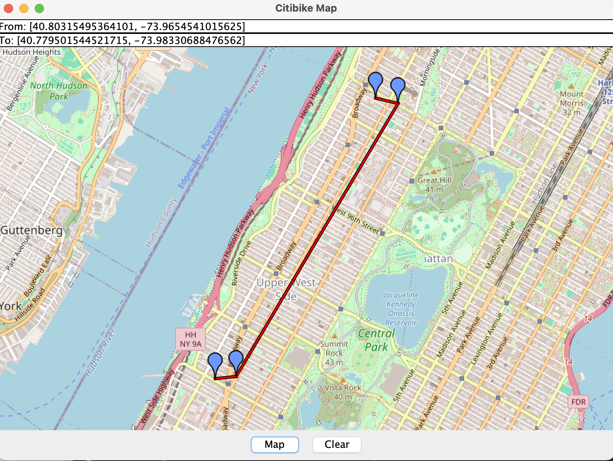

# CitiBike

## Overview
This program allows users to enter two locations: 
their current position and their destination. 
Based on these points, the service finds two CitiBike stations: 
one closest to the user's current location with available bikes, 
and the other nearest to their destination with available docks.

## Graphical User Interface Features
The user can click on two locations on the map, 
and the program will display a route connecting four key points: 
the user’s starting location, 
the nearest bike station with available bikes, 
the nearest station with available docks, 
and the destination. 
By pressing the "Map" button, 
the program draws the route between these locations.

##

